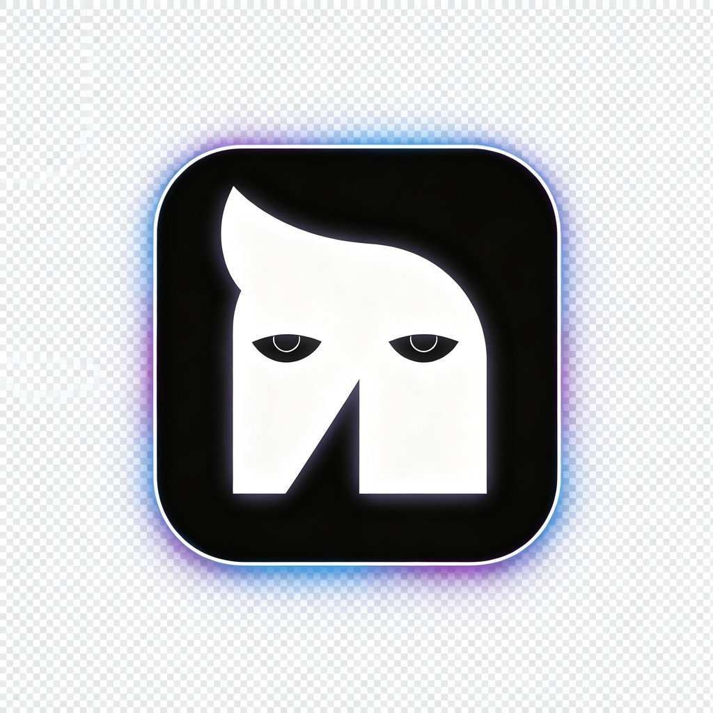
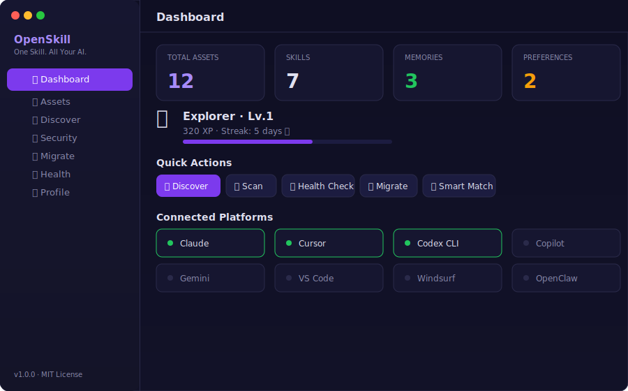

<p align="center">
  
</p>

<h1 align="center">OpenSkill</h1>

<p align="center">
  <strong>One Skill. All Your AI. — Cross-domain AI skill asset manager</strong>
  <br />
  跨域管理 Skills · Memory · Preferences 的开放标准 AI 技能资产管理器
</p>

<p align="center">
  <a href="https://opensource.org/licenses/MIT"></a>
  <a href="https://github.com/KalenTang666/OpenSkill/actions"></a>
  <a href="https://discord.gg/MKdGbqwWsT"></a>
  <a href="./docs/whitepaper-zh.md"></a>
  <a href="./docs/whitepaper-en.md"></a>
</p>

<p align="center">
  <a href="#quick-start">Quick Start</a> ·
  <a href="#why-openskill">Why</a> ·
  <a href="./docs/whitepaper-zh.md">白皮书</a> ·
  <a href="#architecture">Architecture</a> ·
  <a href="#status">Status</a> ·
  <a href="#roadmap">Roadmap</a> ·
  <a href="https://discord.gg/MKdGbqwWsT">Discord</a> ·
  <a href="./CONTRIBUTING.md">Contributing</a>
</p>

---

## The Problem

You use Claude Code at work, Cursor for side projects, and Codex CLI for quick edits. Each one has its own Skills, Memory, and config files. Every time you switch tools, you reconfigure the same coding standards, re-explain your preferences, and lose context.

**Your AI skills are scattered across platforms. OpenSkill unifies them.**

## Why OpenSkill

| Pain Point | OpenSkill Solution |
|---|---|
| Same config on every platform | One hub, sync everywhere |
| Skills locked in one tool | Portable assets with adapter layer |
| Memory lost when switching | Versioned memory with conflict resolution |
| No quality control on skills | Security scanner + quality scoring |
| Privacy scattered across vendors | Local-first, you hold the keys |

Think of it as a **portable skill manager for AI** — not a skill marketplace, but the tool that manages, migrates, and secures the skills you already have. If Skills.sh is npm (registry), **OpenSkill is nvm + npm audit + package-lock.json**.

## Status

> ⚠️ **OpenSkill is in active development.** The architecture, protocols, and core modules are implemented as TypeScript source code. CLI commands are defined but require building from source. npm packages are not yet published.

| Component | Status | Notes |
|-----------|--------|-------|
| CLI (`oski`) | 🟡 Source | 60 commands defined, requires `npm run build` to use |
| TypeScript | ✅ Compiles | Zero errors, strict mode |
| Tests | ✅ 29 passing | Vitest |
| 9 Adapters | 🟡 Scaffold | Adapter interfaces defined, not connected to live APIs |
| MCP Server | 🟡 Source | 9 tools defined |
| Desktop Client | 🟡 Source | Electron app, requires `npm start` to run |
| npm Package | 🔴 Not published | Planned |
| Homebrew | 🔴 Not published | Formula in repo, not yet in a tap |
| DMG Download | 🔴 Not built | Build workflow exists, triggered on release |

## Quick Start

```bash
# Clone the repository
git clone https://github.com/KalenTang666/OpenSkill.git
cd OpenSkill

# Install dependencies
npm install

# Build the CLI
cd packages/cli && npm run build

# Run
npx oski init
npx oski discover
npx oski match "your task"
```

Or install as an Agent Skill:
```bash
npx skills add KalenTang666/OpenSkill
```

## Screenshots

### macOS Desktop Client

<p align="center">
  
</p>

> 7 views: Dashboard · Assets · Discover · Security · Migrate · Health · Profile

### CLI

```bash
$ oski discover

  🔍 Discovered 3 platforms with 5 assets

  ✅ Claude — CLAUDE.md, memory.json, 2 skills
  ✅ Cursor — .cursorrules
  ✅ Codex  — AGENTS.md, 1 skill

$ oski match "react component testing"

  🎯 Smart Match: 2 results

  1. 📦 React Patterns (85/100) — Tags: react, testing
  2. 🌐 Jest Testing (62/100) — Tags: jest, testing
```

## Architecture — 4-Layer Model

Aligned with Claude Code's extension architecture (编程接口层 → 集成层 → 扩展层 → 基础层)

```
┌─────────────────────────────────────────────────────────────┐
│  编程接口层  Agent SDK                                        │
│  TypeScript SDK · 30 public exports · Programmatic access    │
├─────────────────────────────────────────────────────────────┤
│  集成层  Integration                                         │
│  ┌──────────────────┐  ┌────────────────────┐               │
│  │  Headless CLI     │  │  MCP Server         │              │
│  │  60 commands      │  │  9 tools            │              │
│  │  CI/CD ready      │  │  Claude/OpenClaw    │              │
│  └──────────────────┘  └────────────────────┘               │
├─────────────────────────────────────────────────────────────┤
│  扩展层  Extension                                           │
│  Skills · Hooks (22 events) · Smart Match · Intelligence     │
│  Plugin System · Marketplace Ratings                         │
│  9 Adapters: Claude·Codex·Cursor·Copilot·Gemini·VS Code·…  │
├─────────────────────────────────────────────────────────────┤
│  基础层  Foundation                                          │
│  Memory · Ed25519 Crypto · Growth · Hardware Bridge          │
│  Edge Adapter (RPi/Jetson/ESP32) · Live Sync · File Watcher │
└─────────────────────────────────────────────────────────────┘
```

## Core Modules (20)

| Module | Description |
|--------|-------------|
| `wallet` | Asset CRUD, version history, conflict resolution |
| `crypto` | Ed25519 signing, SHA-256 integrity, key management |
| `protocol` | OSP Protocol v1.0 envelope, manifest, diff |
| `migration` | Cross-platform migration, backup/restore (.osp) |
| `hooks` | Event-driven automation (22 events × 5 actions) |
| `smart-match` | Context-aware skill recommendations |
| `hardware-bridge` | Device registry, cross-device sync |
| `edge-adapter` | Skill pruning for IoT/robots (7 device profiles) |
| `skill-intelligence` | 6-dimension quality scoring, usage learning |
| `growth` | XP, 6 ranks, 10 achievements, streak tracking |
| `local-scanner` | Auto-discover configs across 8 platforms |
| `analyzer` | 5-dimension asset quality scoring |
| `skill-hub` | Multi-source skill search |
| `skill-registry` | Local skill registration |
| `live-sync` | Real-time two-way platform sync |
| `file-watcher` | Config change detection |
| `plugin-system` | Community adapter extensibility |
| `marketplace-ratings` | Skill ratings and reviews |
| `registry` | Decentralized asset registry |
| `types` | Shared TypeScript types |

## CLI Commands (`oski`)

```bash
oski init                          # Initialize ~/.openskill/
oski list [--type skill]           # List assets
oski import --from <platform>      # Import from Claude/Cursor/Codex
oski export --to <platform>        # Export to a platform
oski sync --to <platform>          # Two-way sync
oski discover                      # Auto-scan 8 platforms
oski match "task description"      # Smart skill recommendations
oski migrate --from claude --to codex  # Cross-platform migration
oski scan [--all]                  # Security scan (14 rules)
oski sign <id>                     # Ed25519 sign asset
oski hooks --add <event>           # Event-driven automation
oski devices                       # Cross-device management
oski edge --profiles               # IoT device profiles
oski intelligence --score <id>     # Skill quality scoring
oski profile                       # Growth/XP/achievements
oski plugins                       # Plugin management
# ... and 44 more commands
```

## MCP Server Integration

Add to your `claude_desktop_config.json`:

```json
{
  "mcpServers": {
    "openskill": {
      "command": "npx",
      "args": ["-y", "@kalentang666/openskill-mcp-server"]
    }
  }
}
```

> ⚠️ MCP package not yet published to npm. Clone the repo and build from source for now.

## Roadmap

### v1.0.0 — Current (Source Code)

- [x] 60 CLI commands + 20 core modules + 9 adapter scaffolds
- [x] OSP Protocol v1.0 + Ed25519 crypto + security scanner
- [x] Hooks + Smart Match + Hardware Bridge + Edge Adapter + Intelligence
- [x] Growth system + Plugin system + Marketplace ratings
- [x] macOS Desktop Client source (Electron)
- [x] TypeScript strict (zero errors) + 29 tests + CI/CD
- [x] Agent Skills SKILL.md

### Next — Making it real

- [ ] `npm publish` — make `npm install -g @kalentang666/openskill` work
- [ ] Connect adapters to real platform APIs (Claude, Cursor, Codex)
- [ ] macOS DMG binary release
- [ ] Homebrew tap submission
- [ ] End-to-end integration tests with real platforms
- [ ] Web dashboard

### Vision

- [ ] Decentralized skill registry (IPFS)
- [ ] AI-powered skill auto-generation
- [ ] Cross-device real-time sync (WebSocket)
- [ ] Mobile companion app

## Contributing

We welcome contributions! See [CONTRIBUTING.md](./CONTRIBUTING.md) for guidelines.

The most impactful contributions right now:
1. **Connect an adapter to a real API** (e.g., make Claude adapter read actual CLAUDE.md files)
2. **Test on your machine** and report issues
3. **Publish to npm** (help with CI/CD pipeline)

## License

[MIT](./LICENSE) © 2026 Kalen666

---

<p align="center">
  <sub>Built with conviction that your AI data should belong to you.</sub>
  <br />
  <sub>让 AI 数据资产回归用户手中。</sub>
</p>
